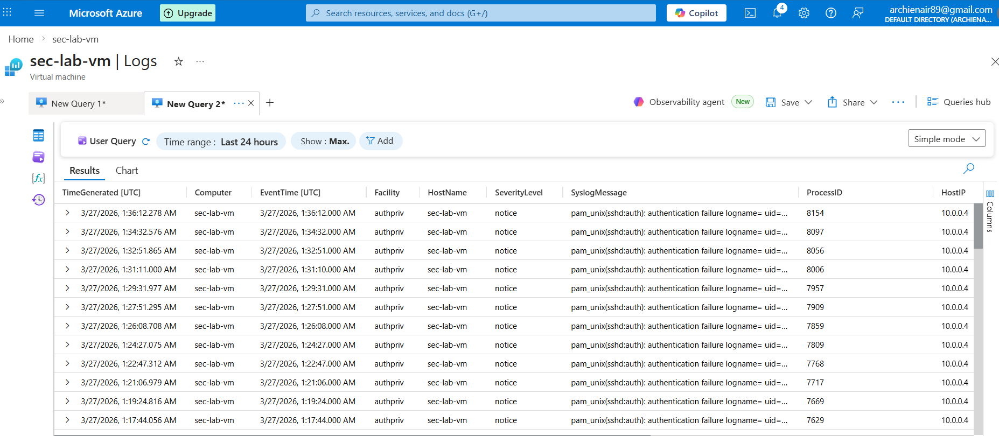
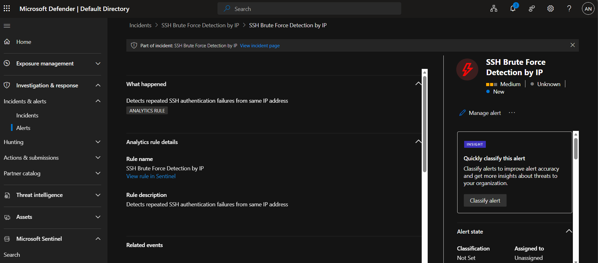
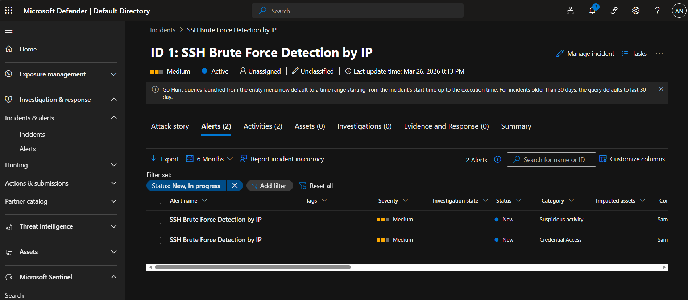

# Azure Sentinel SOC Project – SSH Brute Force Detection

This project demonstrates a cloud-based security detection workflow using Microsoft Sentinel integrated with Microsoft Defender to detect SSH brute force attacks.

---

## 🧠 Overview

This lab simulates SSH brute force activity on an Azure Linux virtual machine and detects it using KQL queries and Microsoft Sentinel analytics rules. Alerts and incidents are generated and investigated in the Microsoft Defender portal.

---

## ⚙️ Architecture

- Azure Virtual Machine (Linux)
- Syslog → Log Analytics Workspace
- Microsoft Sentinel (SIEM)
- Microsoft Defender Portal (Incident Management)

---

## 🔍 Detection Logic

### Raw Log Query

```kql
Syslog
| where SyslogMessage has "authentication failure"
| sort by TimeGenerated desc
```

### Brute Force Detection Query

```kql
Syslog
| where SyslogMessage has "authentication failure"
| parse SyslogMessage with * "rhost=" IP " " *
| summarize FailedAttempts = count() by IP
| where FailedAttempts > 5
```
## 🧩 MITRE ATT&CK Mapping

- Tactic: Credential Access
- Technique: T1110 (Brute Force)
---

## 🚀 Implementation

1. Created Azure Linux virtual machine  
2. Enabled Syslog data collection into Log Analytics  
3. Verified SSH authentication failure logs  
4. Wrote KQL queries to detect repeated login failures  
5. Created analytics rule in Microsoft Sentinel  
6. Configured alert threshold and rule execution  
7. Triggered alerts and incidents in Microsoft Defender  
8. Investigated alerts with full incident context  

---

## 🎯 Outcome

- Detected repeated SSH authentication failures  
- Generated alerts based on detection logic  
- Created incidents in Microsoft Defender portal  
- Demonstrated end-to-end SOC workflow  

Log Ingestion → Detection → Alert → Incident → Investigation  

---

## 📸 Screenshots

### Log Analytics


### Alert Details


### Sentinel Incident


---

## 🛠 Skills Demonstrated

- Microsoft Sentinel (SIEM)  
- Microsoft Defender (XDR / SecOps Portal)  
- KQL (Kusto Query Language)  
- Threat Detection  
- Incident Investigation  

---

## 📌 Key Takeaway

Built a real-world SOC detection pipeline using cloud-native security tools, demonstrating practical skills in threat detection, alerting, and incident response.
